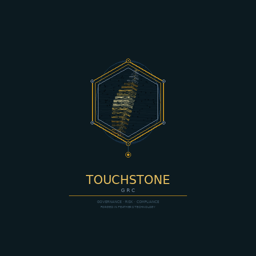

<!-- markdownlint-disable MD033 -->
# Touchstone GRC

<p align="center">
  
</p>

<p align="center">
  Self-hosted compliance evidence collector. Vanta / Drata / Secureframe alternative.
  <br />
  By <a href="https://www.forgedinfeatherstechnology.com">Forged in Feathers Technology</a>.
</p>

<p align="center">
  <a href="https://github.com/ponack/touchstone-grc/releases/tag/v0.1.0"></a>
  <a href="LICENSE"></a>
</p>

---

Sibling project to [Crucible IAP](https://github.com/ponack/crucible-iap). Standalone — runs without Crucible. Optional integration via public API in a later phase.

> **Status:** v0.1.0 shipped 2026-05-25 — Phase 1 MVP. AWS connector, SOC 2 evaluation (CC6.1 + CC6.3 real, 9 controls awaiting their AWS service), CSV + PDF auditor exports. Phase 2 expands AWS service coverage so the remaining SOC 2 controls become real evaluations.

## What it does

- Connects (read-only) to your cloud + SaaS estate: AWS today; GCP, Azure, GitHub, Okta, Google Workspace, M365 on the roadmap
- Runs scans, collects evidence artifacts, evaluates them against control packs via embedded OPA
- Ships control packs for SOC 2 today; CIS AWS / HIPAA / PCI-DSS / ISO 27001 on the roadmap
- Append-only evidence trail, auditor read-only role, auditor-grade CSV + PDF exports
- Exception workflow for acknowledged gaps without erasing the audit trail

## Stack

- Backend: Go + Echo, embedded OPA
- Frontend: SvelteKit 5 + Tailwind v4
- DB: PostgreSQL + River job queue
- Object storage: MinIO (S3-compatible)
- Auth: OIDC PKCE (Authentik bundled, or any generic OIDC IdP) + local-auth bootstrap admin
- Reverse proxy: Caddy (bundled, optional)
- Scan isolation: ephemeral Docker containers (read-only, no-new-privileges, cap-drop ALL)

## Quickstart

```bash
git clone https://github.com/ponack/touchstone-grc
cd touchstone-grc
cp .env.example .env
# fill in TOUCHSTONE_BASE_URL, TOUCHSTONE_SECRET_KEY, POSTGRES_PASSWORD, MINIO_SECRET_KEY
docker network create touchstone-scanner
docker compose up -d
```

Or pull pre-built images directly:

```text
ghcr.io/ponack/touchstone-api:0.1.0
ghcr.io/ponack/touchstone-ui:0.1.0
```

Running behind an external reverse proxy (OPNsense, Traefik, nginx, separate Caddy)?
See [docs/reverse-proxy.md](docs/reverse-proxy.md) for the routing rules + a working
Caddy / nginx snippet.

## Roadmap

- **Phase 0** — Foundation: auth, RBAC (admin/member/auditor), audit log, OPA, multi-org. *(complete)*
- **Phase 1** — MVP: AWS connector + SOC 2 control pack subset + auditor export. *(complete — v0.1.0)*
- **Phase 2** — AWS depth: each new service (S3, EC2 SGs, CloudTrail, GuardDuty, Config, RDS) lights up another SOC 2 control.
- **Phase 3** — Connector breadth: GitHub, Google Workspace, Okta, M365.
- **Phase 4** — Framework breadth: CIS AWS, HIPAA, PCI-DSS, ISO 27001.
- **Phase 5** — GRC surface: personnel, asset inventory, vendor register, risk register.
- **Phase 6** — Trust Center: public compliance page + questionnaire automation.
- **Phase 7** — Optional Crucible IAP connector (scans Crucible stacks/runs/policies as evidence).

## License

AGPL-3.0. Same as Crucible IAP.
